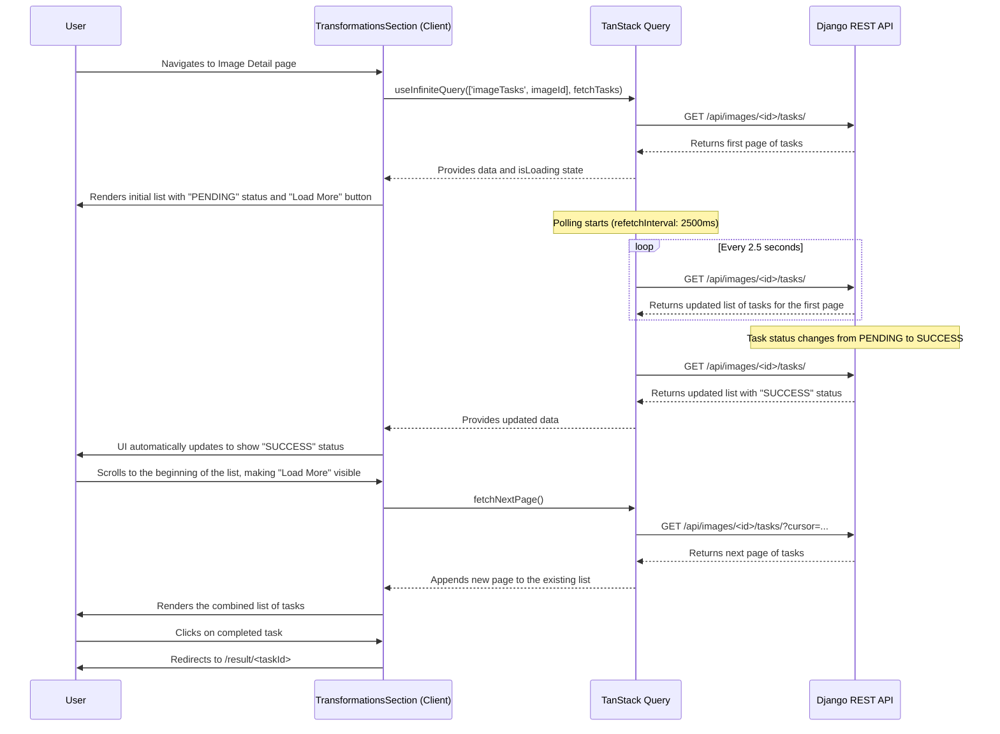

# Technical Design: T403 - Build Transformations Section & Polling

## Overview

This document outlines the technical design for implementing the "Transformations" section on the Image Detail page. The core of this feature is to provide users with a real-time view of their image transformation tasks.

The technical approach centers on creating a set of modular React components that will:

1.  Fetch the list of transformation tasks for a specific image.
2.  Implement a polling mechanism using **TanStack Query** to periodically refresh the task statuses.
3.  Dynamically update the UI to reflect the current state of each task (e.g., PENDING, SUCCESS, FAILED).
4.  Provide clear visual feedback and navigation for completed tasks.

Polling will be managed efficiently, starting when the component mounts and stopping automatically once all tasks have reached a terminal state (SUCCESS or FAILED). This ensures a responsive user experience without placing an unnecessary load on the server, aligning with `T403-NR02`.

## Architecture

### Component Hierarchy

The feature has been implemented with the following component structure, which should be maintained:

```
- TransformationsSection (Container)
  - TransformationCard
    - Badge (reused from shadcn/ui)
    - Progress (reused from shadcn/ui)
    - Skeleton (reused from shadcn/ui)
```

- **`TransformationsSection`**: This existing container component already handles the core logic, including data fetching and polling with TanStack Query. It renders the list of transformations in a horizontally scrollable view.
- **`TransformationCard`**: This existing component serves as the detailed view for a single transformation task. It correctly displays various statuses (`PENDING`, `IN_PROGRESS`, `SUCCESS`, `FAILED`) with appropriate visual indicators and handles user interaction.
- **`LoadMoreCard`**: This new component will be displayed at the beginning of the list and will trigger the loading of the next page of tasks when it becomes visible.

### Data Flow

The following Mermaid diagram illustrates the data flow for the primary user story: viewing real-time status updates of a transformation task.



## Components and Interfaces

### `TransformationsSection` Component (Existing)

- **Purpose & Responsibilities**: This component is the smart container that orchestrates the display of transformation tasks. It will be refactored to use TanStack Query's `useInfiniteQuery` hook to handle pagination. It will manage polling for the most recent page of tasks and will stop polling when all tasks on that page are in a terminal state. It will also be responsible for rendering the `LoadMoreCard` and fetching subsequent pages.
- **Props**:
  ```typescript
  interface TransformationsSectionProps {
    imageId: number;
  }
  ```
- **Data Fetching Strategy**: It will use `useInfiniteQuery` to fetch paginated data from the `GET /api/images/<id>/tasks/` endpoint. The `getImageTransformationTasksById` function will need to be updated to support cursor-based pagination.
- **Required Refactoring**: The component must be refactored from `useQuery` to `useInfiniteQuery`. The logic for polling should be adapted to only refetch the first page, and a mechanism to trigger `fetchNextPage` must be implemented.

### `TransformationCard` Component (Existing)

- **Purpose & Responsibilities**: This component is responsible for rendering a single transformation task with all its visual states (status, format, parameters, timestamp). It correctly handles clickability for completed tasks and includes accessibility attributes.
- **Props**:
  ```typescript
  interface TransformationCardProps {
    task: TransformationTask;
    onClick?: (taskId: string) => void;
    isClickable: boolean;
  }
  ```
- **Side effects**: Handles navigation via the `onClick` prop.
- **Assessment**: This component is well-implemented and meets requirements. No refactoring is needed.

#### User Interface Design

- **Layout Structure**: A vertical list of items within a card or a dedicated section. Each item will be a row containing the task details.
- **Design Specifications**:
  - **Structure**: Each list item will be a `Card` component from shadcn/ui.
  - **Visual States**:
    - **PENDING**: A yellow/amber badge with the text "Pending".
    - **SUCCESS**: A green badge with the text "Success". The entire item will be clickable.
    - **FAILED**: A red badge with the text "Failed". The item will not be clickable.
    - **Loading**: The `TransformationList` will display a series of `Skeleton` components while the initial data is being fetched.

### Error Handling

- **API Errors**: TanStack Query's `isError` and `error` states will be used within `TransformationsSection` to handle API failures. A user-friendly error message will be displayed if the initial task list cannot be fetched.
- **Task Failures**: As per `T403-FR05`, if a task's status is "FAILED", the `TransformationListItem` will display this status clearly. It will not be interactive.

#### Error Recovery

- If the polling API call fails, TanStack Query will automatically retry with exponential backoff, providing resilience against transient network issues. If the failure persists, an error message will be shown to the user.

## Testing Strategy

### Unit Tests

- **`TransformationCard`**: Unit tests for this component already exist and provide good coverage for different states and user interactions. These should be maintained.

### Integration Tests

- **`TransformationsSection`**:
  - Mock the API response and test the full data fetching and polling flow.
  - Verify that the component renders the list correctly after a successful fetch.
  - Verify that polling stops when all tasks are in a terminal state.
  - Verify that an error state is handled gracefully if the API mock returns an error.

### End-to-End Tests

- **User Workflows**:
  1.  **Full Success Flow**: Log in, navigate to an image, see a "PENDING" task, wait for it to become "SUCCESS", and click it to navigate to the result page.
  2.  **Failure Flow**: Log in, navigate to an image, and verify that a "FAILED" task is displayed correctly and is not clickable.

## Performance Considerations

- **Optimization Strategies**:
- **High-Volume Performance**: The implementation of cursor-based pagination with `useInfiniteQuery` is the primary strategy for handling a large number of tasks efficiently. This avoids loading all tasks at once, ensuring the UI remains performant regardless of the total number of transformations. Virtualization is no longer the primary strategy but can be reconsidered if individual page sizes become excessively large.
- **Monitoring**: The performance of the `GET /api/images/<id>/tasks/` endpoint will be monitored to ensure it stays below the 300ms response time target defined in `T403-NR01`.

## Implementation Notes

### Technology Integration

- **State Management**: TanStack Query will be the single source of truth for server state related to transformation tasks. No additional client-side state (e.g., in Zustand or `useState`) will be needed to manage the tasks themselves.
- **Styling**: Tailwind CSS and shadcn/ui components will be used for all styling to maintain consistency with the existing application.

### Accessibility Considerations

- Status badges will have appropriate `aria-label` attributes to be descriptive for screen readers (e.g., "Status: Task failed").
- Loading states will use `aria-busy="true"` to inform assistive technologies that content is loading.
- The list will be structured semantically using `<ul>` and `<li>` elements.
