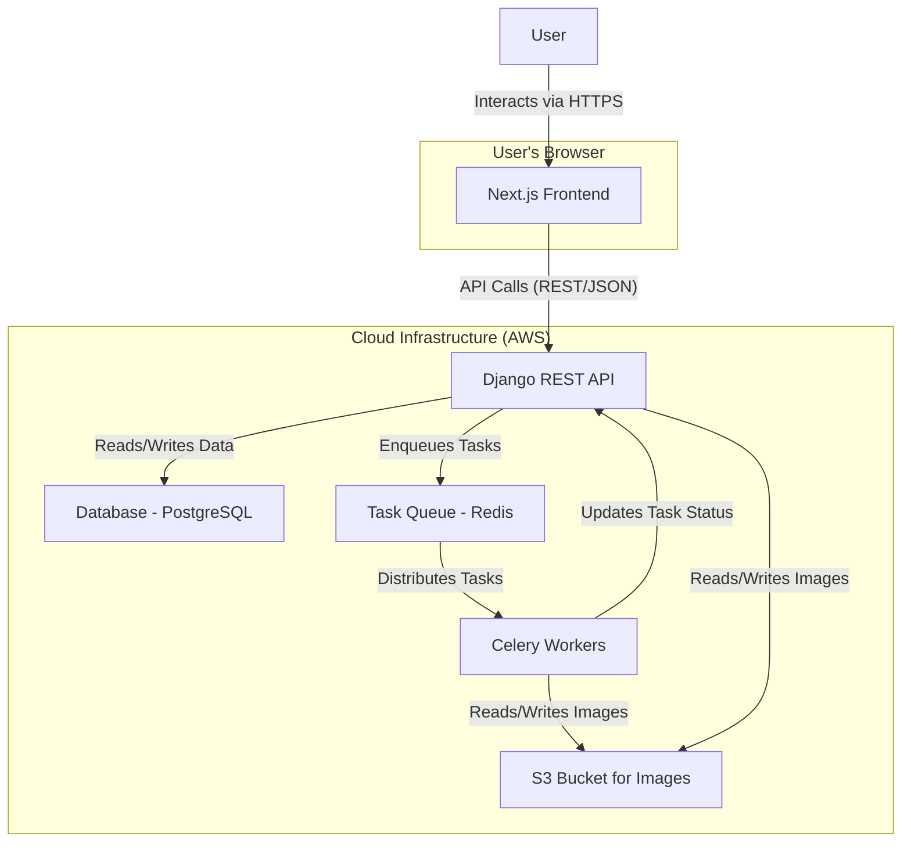

# Technical Architecture: Image Processing Service

## 1. High-Level Overview

This document outlines the technical architecture for the Image Processing Service's frontend application. The system follows a **Client-Server architecture**, where a modern Next.js single-page application (SPA) serves as the client for a powerful Django-based backend API.

The frontend itself is designed as a **Monolithic Frontend**. This approach is well-suited for this project as it consolidates all UI-related concerns into a single, cohesive codebase. This simplifies development, testing, and deployment, providing a strong foundation for the defined feature set.

The backend is responsible for all business logic, including user authentication, data persistence, and, most critically, asynchronous image processing. It leverages a task queue system (Celery/Redis) to handle long-running transformation jobs, ensuring the frontend remains responsive and the user experience is fluid. This clear separation of concerns—with the Next.js app handling presentation and the Django API managing core logic—creates a scalable and maintainable system.

## 2. Architectural Diagram

The following diagram illustrates the high-level system architecture, showing the key components and their interactions.



## 3. Logical Data Models

The system's data models are defined by the backend API. The frontend types in `lib/types.ts` should be updated to match this source of truth to prevent data loss and ensure type safety.

- **User** (from `/api/auth/user/`)

  - `pk` or `id`: Number (Unique Identifier)
  - `username`: String
  - `email`: String
  - `first_name`: String
  - `last_name`: String
  - **\*Note:** The `User` type in `lib/types.ts` is critically out of sync and should be updated to match this structure.\*

- **SourceImage** (from `/api/images/<id>/`)

  - `id`: Number (Unique Identifier)
  - `owner`: Number (Foreign Key to User)
  - `file`: String (URL to the image file in S3)
  - `file_name`: String
  - `description`: String | null
  - `metadata`: JSON
  - `created_at`: DateTime
  - `updated_at`: DateTime

- **TransformationTask** (from `/api/tasks/<id>/`)

  - `id`: Number (Unique Identifier)
  - `original_image`: Number (Foreign Key to SourceImage)
  - `result_image`: Number | null (Foreign Key to TransformedImage)
  - `status`: String (Enum: "PENDING", "SUCCESS", "FAILED", etc.)
  - `transformations`: JSON (An array of transformation objects)
  - `format`: String (e.g., "JPEG", "PNG")
  - `error_message`: String | null
  - `created_at`: DateTime
  - `updated_at`: DateTime

- **TransformedImage** (from `/api/images/transformed/<id>/`)
  - `id`: Number (Unique Identifier)
  - `source_image`: Number (Foreign Key to SourceImage)
  - `transformation_task`: Number (Foreign Key to TransformationTask)
  - _(Inherits fields from a base image model like `file`, `file_name`, `owner`, etc.)_

### Relationships

- A `User` **owns** many `SourceImage`s (one-to-many).
- A `SourceImage` **has** many `TransformationTask`s (one-to-many).
- A `TransformationTask` **produces** one `TransformedImage` (one-to-one).

## 4. Interfaces & Communication Patterns

Communication between the Next.js frontend and the Django backend occurs via a RESTful API over HTTPS. All endpoints are prefixed with `/api`.

### Key API Endpoints (from API Documentation)

- **Authentication (`/auth/`)**

  - `POST /auth/registration/`: Creates a new user.
  - `POST /auth/login/`: Authenticates a user and returns JWTs.
  - `POST /auth/logout/`: Invalidates the user's session.
  - `GET /auth/user/`: Retrieves authenticated user's details.
  - `PUT, PATCH /auth/user/`: Updates user details.
  - `POST /auth/password/reset/`: Initiates password reset.
  - `POST /token/refresh/`: Refreshes the access token.
  - `POST /token/verify/`: Verifies a token.

- **Image Management (`/images/`)**

  - `POST /images/upload/`: Uploads a new source image.
  - `GET /images/`: Lists all of the user's source images.
  - `GET /images/<id>/`: Retrieves a specific source image.
  - `GET /images/transformed/`: Lists all of the user's transformed images.
  - `GET /images/transformed/<id>/`: Retrieves a specific transformed image.

- **Image Transformation**
  - `POST /images/<id>/transform/`: Submits a new transformation task.
  - `GET /tasks/`: Lists all transformation tasks for the user.
  - `GET /tasks/<id>/`: Retrieves a specific transformation task.

### Example Payload (Task Creation)

_Request to `POST /api/images/123/transform/`_

```json
{
  "format": "jpeg",
  "transformations": [
    { "operation": "resize", "params": { "width": 800, "height": 600 } },
    { "operation": "apply_filter", "params": { "grayscale": true } }
  ]
}
```

_Response_

```json
{
  "id": 0,
  "status": "PENDING",
  "original_image": 123,
  "result_image": null
}
```

## 5. Authentication & Authorization Strategy

### Authentication

The system uses **JSON Web Tokens (JWT)** with a **refresh token pattern** for authentication.

1.  **Login**: A user submits credentials to `POST /api/auth/login/`. The backend validates them and returns an `access_token` and a `refresh_token`. The API documentation implies these are returned in the response body, but for web client security, they **should be delivered via secure, `HttpOnly` cookies**.
2.  **Session Management**: The `access_token` (short-lived) is sent with each API request to authenticate the user. The `refresh_token` (long-lived) is stored securely and is used only to obtain a new access token.
3.  **Token Refresh**: When the `access_token` expires, the client will receive a `401 Unauthorized` error. The client should then use the `refresh_token` to call `POST /api/token/refresh/` to get a new `access_token` and retry the original request. This process should be automated within the API client (e.g., an Axios interceptor).
4.  **Global Error Handling**: The existing `axios` interceptor correctly handles `401` errors by logging the user out. This should be enhanced to differentiate between an expired token (which should trigger a refresh) and an invalid session (which should trigger a logout).
5.  **Logout**: The `logoutUser` function sends a `POST /api/auth/logout/` request. The backend invalidates the tokens/session.

### Authorization

1.  **Backend (API)**: The Django API validates the JWT on every protected request and enforces data ownership based on the user ID in the token.
2.  **Frontend (Client)**:
    - **Route Protection**: Next.js middleware (`middleware.ts`) protects routes by checking for the presence of authentication state, redirecting unauthenticated users to the login page.
    - **UI State**: The global Zustand store (`authStore`) holds the user's authentication status and profile information, allowing UI components to render conditionally.

## 6. Cross-Cutting Concerns

### Error Handling & Logging

- **Frontend**:

  - **API Errors**: An Axios interceptor is used to handle global API responses. It specifically catches `401 Unauthorized` errors to log the user out automatically. Other client and server errors are managed by TanStack Query, which provides hooks for error states (`isError`, `error`).
  - **UI Errors**: React Error Boundaries will be implemented at the root level to catch and handle rendering errors gracefully, preventing a full application crash.
  - **Logging**: All critical errors will be logged to an external monitoring service (e.g., Sentry, LogRocket) to enable proactive debugging and monitoring.

- **Backend**: The Django API will have its own robust logging and exception handling, configured to log detailed error information (including stack traces) to a service like AWS CloudWatch.

### Security Considerations

- **Data in Transit**: All communication between the client and server is enforced over **HTTPS**.
- **Authentication**: JWTs should be stored in **`HttpOnly` cookies** to prevent access from client-side JavaScript.
- **Input Validation**: All user input is validated on the client-side using **Zod** before being sent to the API. The backend performs its own authoritative validation to protect against malicious requests.
- **CORS**: The Django API will be configured with a strict Cross-Origin Resource Sharing (CORS) policy, allowing requests only from the frontend application's domain.
- **Resource Access**: The API enforces strict ownership rules, ensuring users can only access and modify their own data (e.g., their images and transformation tasks).
