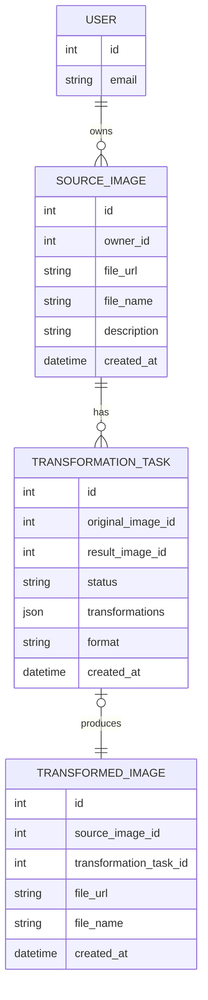

# Technical Audit & System Overview

## 1. High-Level System Purpose

This project is a modern, responsive frontend application for an existing Django-based Image Processing API. Its primary purpose is to provide a user-friendly interface for users to manage their images, apply various transformations, and track the status of these operations. The application is designed to be intuitive, drawing inspiration from services like remove.bg for a seamless user experience, particularly in the image upload process.

## 2. Core Features & User Stories

Based on the project documentation and codebase analysis, the following core features are implemented or planned:

- **Authentication:**
  - As a new user, I can create an account to access the service.
  - As an existing user, I can log in to my account.
  - As an authenticated user, I can log out of my session.
- **Image Management:**
  - As an authenticated user, I can upload an image via a drag-and-drop interface.
  - As an authenticated user, I can view a detailed page for each of my uploaded images.
- **Image Transformation:**
  - As an authenticated user, I can select and apply various transformations (e.g., crop, resize, grayscale) to my images.
  - As an authenticated user, I can see the status of my image transformation tasks in real-time.
  - As an authenticated user, I can view and download the final transformed image.
- **Dashboard & History:**
  - As an authenticated user, I can view a dashboard that displays a history of my uploaded and transformed images.

## 3. Technology Stack & Architecture

The application is a modern single-page application (SPA) built with a focus on type safety, component-based UI, and efficient state management.

- **Primary Technologies:**
  - **Framework:** Next.js (App Router)
  - **Language:** TypeScript
  - **UI Components:** shadcn/ui, Radix UI
  - **Styling:** Tailwind CSS
  - **Global State:** Zustand
  - **Server State:** TanStack Query (React Query)
  - **Forms:** React Hook Form & Zod
  - **API Client:** Axios
- **Architecture:**
  - The frontend follows a **monolithic architecture**, acting as a client for the backend Django API.
  - It uses the **Next.js App Router** for file-based routing and layout management, with route groups for `(auth)` and `(main)` application sections.
  - The architecture clearly separates concerns, with dedicated directories for components, API logic, state management, and utilities.

## 4. Data Model

The application revolves around four main data entities that model the core domain of image processing.

- **User:** Represents a registered user of the application.
- **SourceImage:** Represents an original image uploaded by a user.
- **TransformedImage:** Represents the result of a transformation task applied to a `SourceImage`.
- **TransformationTask:** Represents an asynchronous task for applying one or more transformations to a `SourceImage`.

### Entity-Relationship Diagram (MermaidJS)

## 5. External Dependencies & Integrations

- **Django Backend API:** The primary dependency is the external RESTful API that handles all business logic, including:
  - User authentication and management.
  - Image storage and retrieval.
  - Asynchronous image processing via Celery/Redis.
- **Amazon S3:** As mentioned in the project plan, the Django backend uses AWS S3 for image storage. The Next.js configuration should be set up to allow images from the S3 bucket domain.

## 6. Potential Technical Debt & Refactoring Opportunities

The codebase is generally well-structured, but there are several areas that could be improved:

- **Inefficient Data Fetching:** The `getImageTransformationTasks` function in [`lib/api.ts`](lib/api.ts) fetches all tasks for a user and then filters them on the client side. This is inefficient and will scale poorly. A dedicated API endpoint `GET /api/images/<id>/tasks/` should be created to fetch tasks for a specific image.
- **Incomplete Type Definitions:** The `User` type in [`lib/types.ts`](lib/types.ts) only includes `id` and `email`, while the API documentation shows that the login and registration endpoints return a more complete `User` object with `username`, `first_name`, and `last_name`. This discrepancy can lead to lost data on the client side.
- **Hardcoded Values:** The `uploadImage` function in [`lib/api.ts`](lib/api.ts) contains a hardcoded `"TODO"` for the image description. This should be replaced with a dynamic value or removed if not needed.
- **Unclear Logout Logic:** The `logout` function in the `authStore` relies on the API returning a 401 status to clear the user's session, which is not guaranteed if the logout endpoint succeeds. The client-side state should be cleared immediately after the logout request is successful.
- **Lack of Comprehensive Testing:** While some test files exist, the project lacks sufficient test coverage, especially for critical user flows like authentication and image transformation.
- **Incomplete Features:** The project plan indicates that several key features, such as the user dashboard and toast notifications, are not yet implemented.
- **Commented-out Code:** The dashboard page at [`app/(main)/dashboard/page.tsx`](<app/(main)/dashboard/page.tsx>) contains commented-out test code that should be removed.

## 7. Key Questions for Stakeholders

To clarify requirements and guide future development, the following questions should be addressed:

1.  **User Model:** What user information is essential for the frontend? Should the `User` type in [`lib/types.ts`](lib/types.ts) be updated to match the full API response, and should this information be displayed in the UI?
2.  **API Efficiency:** Can a new backend endpoint be created to fetch transformation tasks for a specific image ID? This would improve performance by avoiding client-side filtering.
3.  **Feature Prioritization:** What is the priority for implementing the remaining features from the project plan, such as the user dashboard, toast notifications, and improved loading states?
4.  **Error Handling:** Is the current global 401 error handling sufficient? Should there be a more nuanced approach for handling different types of authentication errors, such as expired tokens that could be refreshed?
5.  **Future Roadmap:** Are there any plans for new features or integrations beyond what is outlined in the current project plan?
